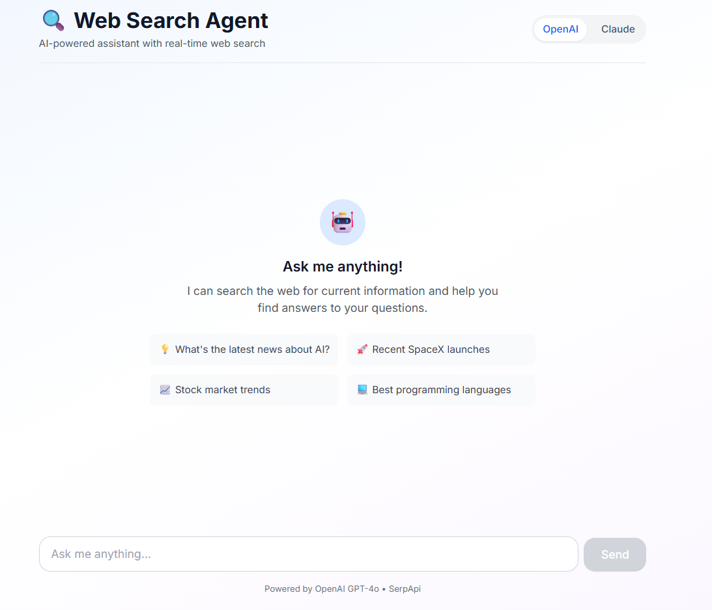

# 🔍 Web Search Agent

An intelligent AI-powered web search assistant built with Next.js, TypeScript, and TailwindCSS. The agent uses OpenAI GPT-4o or Claude Sonnet to reason about user queries and perform real-time web searches to provide accurate, cited answers.

## ✨ Features

- **🧠 Dual LLM Support**: Choose between OpenAI GPT-4o or Claude Sonnet
- **🔍 Real-Time Web Search**: Live search integration using SerpApi
- **💬 Interactive Chat UI**: Modern, responsive chat interface
- **📚 Source Citations**: All answers include proper source attribution
- **🎯 Smart Tool Usage**: Agent intelligently decides when to search
- **⚡ Fast & Efficient**: No vector database overhead - everything happens in real-time
- **🎨 Beautiful Design**: Gradient backgrounds and smooth animations

## 🏗️ Architecture

This project follows the **ReAct pattern** (Observe → Think → Act → Answer):

1. **User Query** → User asks a question
2. **LLM Reasoning** → Agent decides if search is needed
3. **Tool Execution** → Searches web via SerpApi if necessary
4. **Synthesis** → Agent processes results and formulates answer
5. **Response** → User receives cited, accurate information

### Tech Stack

- **Frontend**: React, Next.js 14 (App Router), TailwindCSS
- **Backend**: Next.js API Routes, TypeScript
- **LLMs**: OpenAI GPT-4o, Anthropic Claude Sonnet
- **Search**: SerpApi (Google Search API)
- **Deployment**: Vercel-ready

## 🚀 Quick Start

### Prerequisites

- Node.js 18+ installed
- API keys for:
  - OpenAI (if using GPT-4o) - [Get key](https://platform.openai.com/api-keys)
  - Anthropic (if using Claude) - [Get key](https://console.anthropic.com/)
  - SerpApi (required) - [Get key](https://serpapi.com/manage-api-key)

### Installation

1. **Clone or download the project**

```bash
cd web-search-agent
```

2. **Install dependencies**

```bash
npm install
```

3. **Set up environment variables**

Create a `.env.local` file in the root directory:

```bash
cp .env.local.example .env.local
```

Edit `.env.local` and add your API keys:

```env
# At least one LLM provider is required
OPENAI_API_KEY=sk-...
ANTHROPIC_API_KEY=sk-ant-...

# Required for web search
SERPAPI_KEY=your_serpapi_key
```

4. **Run the development server**

```bash
npm run dev
```

5. **Open your browser**

Navigate to [http://localhost:3000](http://localhost:3000)

## 📖 Usage

### Basic Chat

1. Type your question in the input field
2. Press Enter or click Send
3. The agent will:
   - Determine if a web search is needed
   - Search the web if necessary
   - Provide a cited answer with sources

### Switching Providers

Toggle between OpenAI and Claude using the buttons in the header.

### Example Queries

- "What's the latest news about AI?"
- "Tell me about recent SpaceX launches"
- "What are the current stock market trends?"
- "Best programming languages in 2025?"

## 🛠️ Project Structure

```
web-search-agent/
├── app/
│   ├── api/
│   │   └── chat/
│   │       └── route.ts          # Chat API endpoint
│   ├── layout.tsx                # Root layout
│   └── page.tsx                  # Home page
├── components/
│   └── ChatUI.tsx                # Main chat interface
├── lib/
│   ├── agent.ts                  # Agent orchestration logic
│   └── tools/
│       └── searchTool.ts         # Web search implementation
├── styles/
│   └── globals.css               # Global styles
├── .env.local.example            # Environment template
├── next.config.js                # Next.js configuration
├── tailwind.config.js            # TailwindCSS configuration
├── tsconfig.json                 # TypeScript configuration
└── package.json                  # Dependencies
```

## 🔧 Configuration

### Changing Models

Edit `lib/agent.ts` to customize default models:

```typescript
// For OpenAI
model: string = 'gpt-4o'

// For Claude
model: string = 'claude-sonnet-4-20250514'
```

### Adjusting Search Results

Modify the default number of search results in `lib/tools/searchTool.ts`:

```typescript
export async function searchWeb(
  query: string,
  numResults: number = 5  // Change this default value
)
```

### System Prompt

Customize the agent's behavior by editing the `SYSTEM_PROMPT` in `lib/agent.ts`.

## 🚢 Deployment

### Deploy to Vercel (Recommended)

1. Push your code to GitHub

2. Import your repository in [Vercel](https://vercel.com)

3. Add environment variables in the Vercel dashboard:
   - `OPENAI_API_KEY`
   - `ANTHROPIC_API_KEY`
   - `SERPAPI_KEY`

4. Deploy! 🎉

### Deploy to Other Platforms

This is a standard Next.js app and can be deployed to any platform that supports Node.js:

- Netlify
- Railway
- Render
- AWS Amplify
- DigitalOcean App Platform

## 🧪 Testing

Run type checking:

```bash
npm run type-check
```

Run linting:

```bash
npm run lint
```

## 📝 API Reference

### POST `/api/chat`

Send a chat message and receive an AI response.

**Request Body:**

```json
{
  "message": "Your question here",
  "history": [
    {
      "role": "user",
      "content": "Previous message"
    },
    {
      "role": "assistant",
      "content": "Previous response"
    }
  ],
  "provider": "openai",  // or "claude"
  "model": "gpt-4o"      // optional
}
```

**Response:**

```json
{
  "content": "The agent's response",
  "searchPerformed": true,
  "searchQuery": "the search query used"
}
```
## UI view 


## 🔒 Security Notes

- Never commit `.env.local` to version control
- API keys are only used server-side
- Rate limiting is recommended for production
- Consider adding authentication for public deployments

## 🐛 Troubleshooting

### "API key not configured" error

Make sure you've created `.env.local` and added your API keys.

### SerpApi rate limits

Free tier: 100 searches/month. Upgrade at [serpapi.com/pricing](https://serpapi.com/pricing)

### Module not found errors

Run `npm install` to ensure all dependencies are installed.

## 🤝 Contributing

Contributions are welcome! Please feel free to submit a Pull Request.

## 📄 License

MIT License © 2025

## 🙏 Acknowledgments

- [OpenAI](https://openai.com/) for GPT-4o
- [Anthropic](https://anthropic.com/) for Claude
- [SerpApi](https://serpapi.com/) for search capabilities
- [Vercel](https://vercel.com/) for Next.js and hosting

## 📚 Further Reading

- [Next.js Documentation](https://nextjs.org/docs)
- [OpenAI API Documentation](https://platform.openai.com/docs)
- [Anthropic Claude Documentation](https://docs.anthropic.com/)
- [SerpApi Documentation](https://serpapi.com/search-api)
- [TailwindCSS Documentation](https://tailwindcss.com/docs)

---

**Built with ❤️ using Next.js, TypeScript, and AI**
